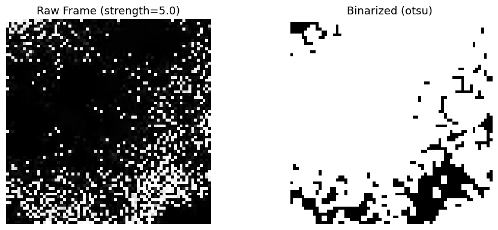
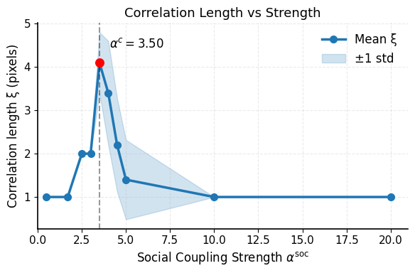

# VIDEO-CORRLENGTH

A lightweight pipeline for extracting spatial correlation lengths from videos of collective behaviour by leveraging the Fourier transform. 

This pipeline was developed in 2026 by me, Bianca Ariani (biancaariani1@gmail.com), during my Master thesis project in the Collective Information Processing group of prof. [Pawel Romanczuk](https://scholar.google.com/citations?user=CKoH18sAAAAJ&hl=de) ([ITB, HU Berlin](https://itb.biologie.hu-berlin.de/wiki/)), where I worked on self-organized criticality in an agent-based bio-inspired model of the fish species *Poecilia sulphuraria* (Sulphur molly).

Previous work on this model system: 
* [Goméz-Nava et al. 2023](https://www.nature.com/articles/s41567-022-01916-1)
* [Sevinchan et al. 2024](https://link.springer.com/chapter/10.1007/978-3-031-71533-4_10)

## Spatial assumptions — important!

*The pipeline was developed for videos where agents move on a regular 2D lattice (think cellular automata), so pixel space maps directly and isotropically onto physical space. The Fourier-based analysis is only meaningful under this condition. If you want to apply it to videos of real animals in the wild — fish tanks filmed from the side, bird flocks in perspective, drone footage — you will likely need to preprocess the footage first: rectify the perspective, apply a homographic correction, or otherwise flatten the field of view into a true top-down projection before feeding it into the pipeline.*

## What kind of data this is for

This pipeline is designed for video recordings of biological or simulated collectives — fish schools, bird flocks, agent-based models — where the spatial organisation of the group is the quantity of interest. Each video is expected to correspond to a single value of some control parameter (e.g. social coupling strength, noise intensity, stimulus amplitude), and a set of videos is intended to scan a range of that parameter.

In my work each video captures the activity of the agents (agents in surface or underwater states are black, agents in the diving state are white). This allowed us to generate a proxy of diving cascade activity observed in the biological reference system, which was the phenomenon of interest for our research.

The pipeline assumes:
- Clips are `.mp4` files with a naming convention that encodes the control parameter and (optionally) a random seed, e.g. `run__strength_0.42__seed_3.mp4`
- The collective has reached a stationary state by the end of the recording; only the last N seconds are used
- The group can be reasonably separated from the background by intensity thresholding (Otsu by default)


## What it does

1. **Clip extraction** — trims each raw video to its last N seconds and saves the clips in an auto-created subfolder (`last{N}sec/`)
2. **Binarisation** — converts each frame to a binary occupancy field (in the case of my model frames were already BW to begin with, which simplified thigns quite a bit). An optional, but fundamental, smoothing step removes isolated single-pixel clusters and fills small holes via binary closing; this can be tuned via the `min_cluster_size` and `hole_smooth_size` parameters in `frame_to_binary_smoothing()` within `tools.py`. In our case single pixels reliably map to single agents, but beware that it may very well not be the case for your data. This step is nonetheless **very important** in order to avoid overestimating the contributions from short correlation lengths. Biologically, it is motivated by the fact that surface wave activity - the observable we investigate in the Sulphur Molly system - is a low passed signal, since isolated individual fish diving events would NOT give rise to noticeable waves. You can also set `CHECK_BINARIZATION = True` in the notebook to display a side-by-side raw vs. binarised frame for the first clip of each parameter value, as a sanity check of what the binarized frames look like.



3. **Structure factor** — accumulates the 2D power spectrum across frames with a Hanning window to suppress leakage. An anisotropy metric (angular coefficient of variation of the power spectrum) is computed alongside and printed per video — a high value is a red flag that the spatial assumptions above may be violated.
4. **Correlation length** — recovers the spatial autocorrelation via the Wiener–Khinchin theorem and reads off the 1/e radius ξ
5. **Summary plot** — plots mean ξ ± std across seeds as a function of the control parameter, with the peak annotated 



Intermediate diagnostic plots (2D structure factor, autocorrelation map, radial decay curve) can be enabled per-video by setting `VISUALIZE_INTERMEDIATE = True` in the notebook.

The peak in ξ as a function of the control parameter is a signature of proximity to a critical point (see [Bruce & Wallace 1989](https://books.google.com/books?hl=de&lr=&id=akb2FpZSGnMC&oi=fnd&pg=PA236&dq=Critical+point+phenomena:+universal+physics+at+large+length+scales&ots=yEAQZ4IZCN&sig=4aowHDvH9RtRHAHPN7PiQ_MLbQE)), where spatial correlations are maximally extended.


## Files

| File | Role |
|------|------|
| `extract_video_snippets.py` | CLI tool for stage 1 (clip trimming) |
| `tools.py` | Core analysis functions |
| `correlation_length_analysis.ipynb` | End-to-end worked example |

---
## Installation
```bash
# clone and enter the repo
git clone https://github.com/biancaariani/video-corrlength.git
cd video-corrlength

# create a virtual environment (recommended)
python -m venv .myvirtualenv
source .myvirtualenv/bin/activate  # on Windows: .myvirtualenv\Scripts\activate

# install dependencies
pip install -r requirements.txt
```

**Python 3.10+** required (for `str | None` type hint syntax).
---

## Quick start

```bash
# 1. Trim videos (output dir created automatically)
python extract_video_snippets.py /path/to/my/videos --seconds 20

# 2. Run analysis (see notebook for full parameter reference)
#    Set PARAM_PREFIX to whatever token precedes the value in your filenames
```

See `correlation_length_analysis.ipynb` for the full annotated workflow.


---
### Usage & contact

This pipeline was developed for a specific research context and is shared as-is, without guarantees of generality. **If you use it in your work, a mention or citation is expected.**
For questions, bug reports, or suggestions, feel free to open an issue or reach out directly at biancaariani1@gmail.com

---
© 2026 Bianca Ariani — MIT License